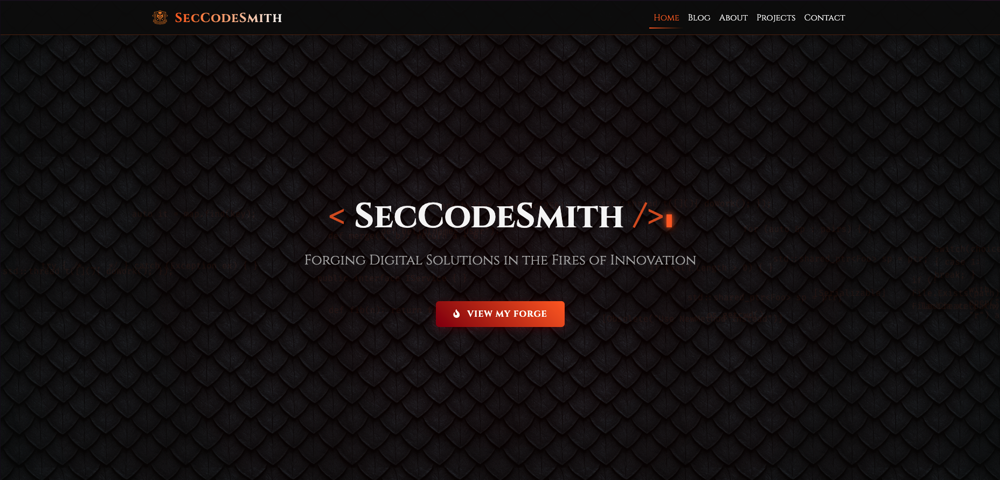

# SecCodeSmith Frontend Portfolio

[](https://opensource.org/licenses/MIT)
[](https://vitejs.dev/)
[](https://reactjs.org/)
[](https://www.typescriptlang.org/)
[](https://sass-lang.com/)



A modern portfolio website with a unique fantasy blacksmith and dragon theme, showcasing my development skills and projects.

**Live Demo**: [https://seccodesmith.pl](https://seccodesmith.pl)

## 🐉 About

This portfolio represents my journey as a developer, designed with the aesthetic of a fantasy blacksmith working alongside dragons. The site combines modern web technologies with creative storytelling to create an engaging user experience.

## 🛠️ Built With

- **[Vite](https://vitejs.dev/)** - Next Generation Frontend Tooling
- **[React](https://reactjs.org/)** - JavaScript library for building user interfaces
- **[TypeScript](https://www.typescriptlang.org/)** - JavaScript with syntax for types
- **[SCSS](https://sass-lang.com/)** - CSS preprocessor for better styling

## 🚀 Getting Started

### Prerequisites

- **Node.js** (v20.0.0 or higher)
- **npm** (v10.0.0 or higher)

You can check your versions by running:
```bash
node --version
npm --version
```

### Installation

1.  Clone the repository:
    ```bash
    git clone https://git.seccodesmith.pl/seccodesmith/seccodesmith-frontend.git
    cd seccodesmith-frontend
    ```
2.  Install dependencies:
    ```bash
    npm install
    ```

### Running the Project

-   **Development Mode**: `npm run dev`
-   **Production Build**: `npm run build`
-   **Preview Production Build**: `npm run preview`

## 🧪 Available Scripts

-   `npm run dev`: Start development server.
-   `npm run build`: Build for production.
-   `npm run preview`: Preview production build.
-   `npm run lint`: Run ESLint.
-   `npm test`: Run tests with Vitest.

## 📁 Project Structure

```
seccodesmith-frontend/
├── public/
│   ├── data/           # JSON files for portfolio content
│   └── images/         # Public images
├── src/
│   ├── assets/
│   │   ├── images/     # Static images for components
│   │   └── styles/     # SCSS style sheets
│   ├── components/     # Reusable React components
│   ├── data/           # Data fetching logic
│   ├── pages/          # Page components
│   ├── utils/          # Utility functions and type definitions
│   ├── App.tsx         # Main App component
│   └── main.tsx        # Application entry point
├── tests/              # Test files
├── .gitignore
├── index.html
├── package.json
├── README.md
└── vite.config.ts
```

## 🎨 Customization

To customize the portfolio for your own use, modify the JSON files in the `public/data` directory.

-   **Personal Information**: `public/data/AboutProps.json`, `public/data/Contact.json`, `public/data/SocialLink.json`
-   **Skills**: `public/data/SkillCardProps.json`
-   **Projects**: `public/data/ProjectProps.json`
-   **Blog**: `public/data/BlogPosts.json`
-   **Styling**: Modify colors and fonts in `src/assets/styles/_variables.scss`

## 📄 License

This project is licensed under the MIT License - see the [LICENSE](LICENSE) file for details.

## 📬 Contact

**SecCodeSmith** - [contact@seccodesmith.pl](mailto:contact@seccodesmith.pl)
